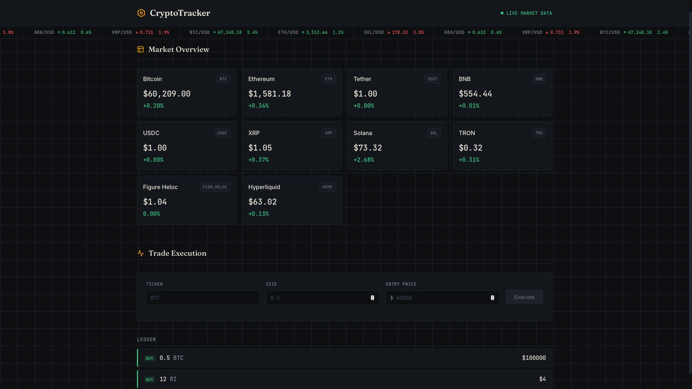

# Angular Crypto Portfolio Tracker

Angular application for tracking live cryptocurrency markets and logging simulated trades.



## Features

* Live cryptocurrency market data from the CoinGecko API
* Simulated cryptocurrency trade logging
* Real-time portfolio updates
* Reactive Forms with validation
* Responsive dark-themed user interface
* Automatic market data polling

## Tech Stack

* Angular (Standalone Components)
* TypeScript
* Angular Signals
* RxJS
* SCSS
* CoinGecko REST API

## Running the Project

Install dependencies:

```bash
npm install
```

Start the development server:

```bash
ng serve
```

Open `http://localhost:4200/` in your browser.

## What I Learned

* Building applications with Angular Standalone Components
* Managing application state using Angular Signals
* Using RxJS for API polling and asynchronous data handling
* Creating Reactive Forms with validation
* Consuming and displaying third-party REST API data
* Organizing scalable Angular applications using feature-based architecture